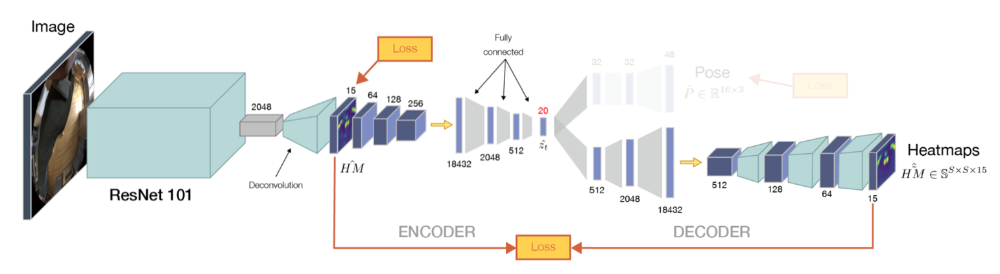
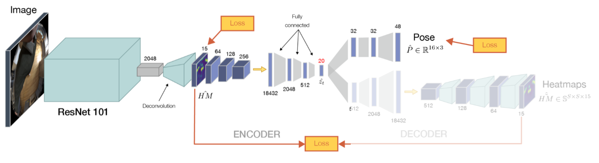
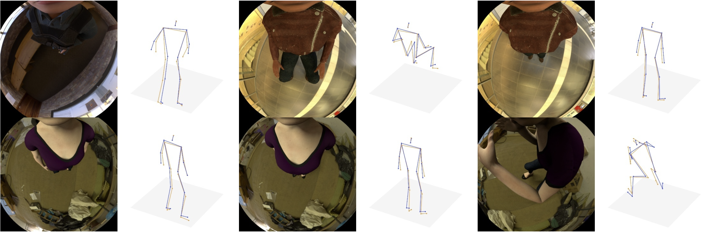

# *x*R-EgoPose

The *x*R-EgoPose Dataset has been introduced in the paper ["*x*R-EgoPose: Egocentric 3D Human Pose from an HMD Camera"](http://openaccess.thecvf.com/content_ICCV_2019/papers/Tome_xR-EgoPose_Egocentric_3D_Human_Pose_From_an_HMD_Camera_ICCV_2019_paper.pdf) (ICCV 2019, oral). It is a dataset of ~380 thousand photo-realistic *egocentric*  camera images in a variety of indoor and  outdoor spaces.


The code contained in this repository is a PyTorch implementation of training and inference code of the model. 

## Downloading the *x*R-EgoPose Dataset

Download the official data set from the [official repository](https://github.com/facebookresearch/xR-EgoPose/releases/tag/v1.0).
The authors provided the downloaded script but it seems to be broken and does not download all the files. It is recommended to download the zip files from the provided link manually.

Once you have downloaded all the tar.gz files, run 
```
python utils/extract_data.py --input {path of the downloaded tar.gz zip files} --output {path to extracted files}
```

Please create folders:

```
/TrainSet
/ValSet
/TestSet
```
Then, put the extracted output folders according to the set type as shown below. 

|Train-set| Test-set | Val-set |
|---------|----------|---------|
|female_001_a_a |female_004_a_a | male_008_a_a |
|female_002_a_a |female_008_a_a | |
|female_002_f_s |female_010_a_a | |
|female_003_a_a |female_012_a_a | |
|female_005_a_a |female_012_f_s | |
|female_006_a_a |male_001_a_a | |
|female_007_a_a |male_002_a_a | |
|female_009_a_a |male_004_f_s | |
|female_011_a_a |male_006_a_a | |
|female_014_a_a |male_007_f_s | |
|female_015_a_a |male_010_a_a | |
|male_003_f_s |male_014_f_s | |
|male_004_a_a | | |
|male_005_a_a | | |
|male_006_f_s | | |
|male_007_a_a | | |
|male_008_f_s | | |
|male_009_a_a | | |
|male_010_f_s | | |
|male_011_f_s | | |
|male_014_a_a | | |

The organized folder structure of dataset should look something like this: 

```
TrainSet
├── female_001_a_a
│   ├── env 01
│   │   └── cam_down
│   │   	├── depth
│   │   	├── json
│   │   	├── objectId
│   │   	├── rgba
│   │   	├── rot
│   │   	└── worldp
│   ├── ...
│   └── env 03
│ 
ValSet
│  
│  
TestSet 
```

## Environment Setup 

Install and Activate Anaconda Environment 
 ```
  conda create -n venv_xrego python=3.7
  conda activate venv_xrego
 ```
Install Pytorch
 ```
pip install torch==1.7.1+cu110 torchvision==0.8.2+cu110 torchaudio==0.7.2 -f https://download.pytorch.org/whl/torch_stable.html
 ```

## Training - 2D Heatmap Module



To train the 2D Heatmap Estimation Module based on Resnet101 Architecture, run:
```
python train.py --training_type train2d --gpu {gpu id} --log_dir {experiments/Train2d} 
```
Training is done for 3 Epochs, 7.0GB of VRAM is needed for training.
On a single 3090 GPU, training takes approximately 30-40 minutes per epoch. 

You can also download the pretrained checkpoint from this [link](https://drive.google.com/drive/folders/1vAmK83MO3UvVd52OQ3X6G8gPQhClZHL0?usp=sharing). The checkpoint is located under *Train2d* folder. 

## Training - 3D Pose Lifting Module


To train the 3D Lifting Module, run:
```
python train.py --training_type train3d --gpu {gpu id} --log_dir {experiments/Train3d}
```
Training is done for 3 Epochs, 3.0GB of VRAM is needed for training.
On a single 3090 GPU, training takes approximately 25-35 minutes per epoch. 

You can also download the pretrained checkpoint from this [link](https://drive.google.com/drive/folders/1vAmK83MO3UvVd52OQ3X6G8gPQhClZHL0?usp=sharing). The checkpoint is located under *Train3d* folder. 

## Finetuning 2D Heatmap & 3D Lifting Module

To finetune the 2D Heatmap and 3D Lifting Module into a single model, run: 
```
python train.py --training_type finetune --gpu {gpu id} --log_dir {experiments/Finetune} --load_2d_model {path to trained 2D Heatmap Module} --load_3d_model {path to trained 3D Pose Lifting Module}
```
Training is done for 3 Epochs, 10GB of VRAM is needed for training. 
On a single 3090 GPU, training takes approximately 40 minutes per epoch. 

You can also download the pretrained checkpoint from this [link](https://drive.google.com/drive/folders/1vAmK83MO3UvVd52OQ3X6G8gPQhClZHL0?usp=sharing). The checkpoint is located under *Finetune* folder. 

## Evaluation: Demo on the Test Dataset

In order to qualitatively and quantitavely evaluate the performance of the model, run the demo:
```
python demo.py --gpu {gpu id} --load_model {path to trained finetuned model} --data{type of data to test on: train, test, val} --save_dir {path of output folder of visualizations}
```

Make sure to load the finetuned model as model path. The default data is set to the testing set. 
The visualization includes the original image with the overlay of predicted 3d joints in orange and the ground truth 3d joints in blue. The terminal prints the MPJPE error in mm. 

## Running Inference on your Custom Data

To run inference on your custom data or other datasets, run:
```
python inference.py --gpu {gpu id} --load_model {path to trained finetuned model} --input_dir{path to folder containing images} --save_dir {path of output folder of visualizations}
```

Since the model is fully trained solely on the xR-EgoPose synthetic dataset, results may not be as expected due to the domain gap. 

## References
Base code is adapted from xR-Egopose's official repository.
The base Resnet101 code is adapted from Microsoft Research Bin Xiao (Bin.Xiao@microsoft.com).
Some parts of the implementation is referenced and adapted from these users: 
@twice154, @ahuard0, @FloralZhao, @jiangyutong. Thanks!
